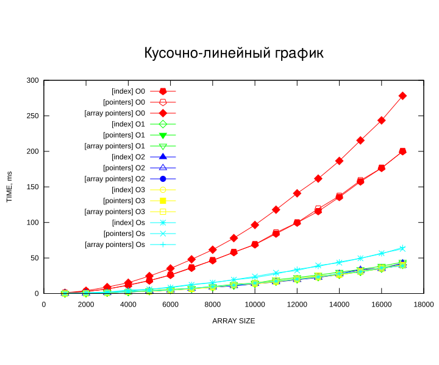
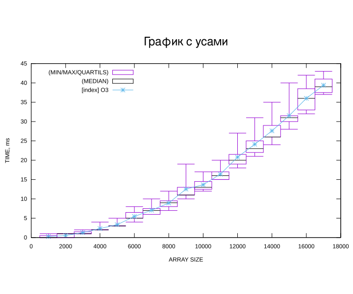
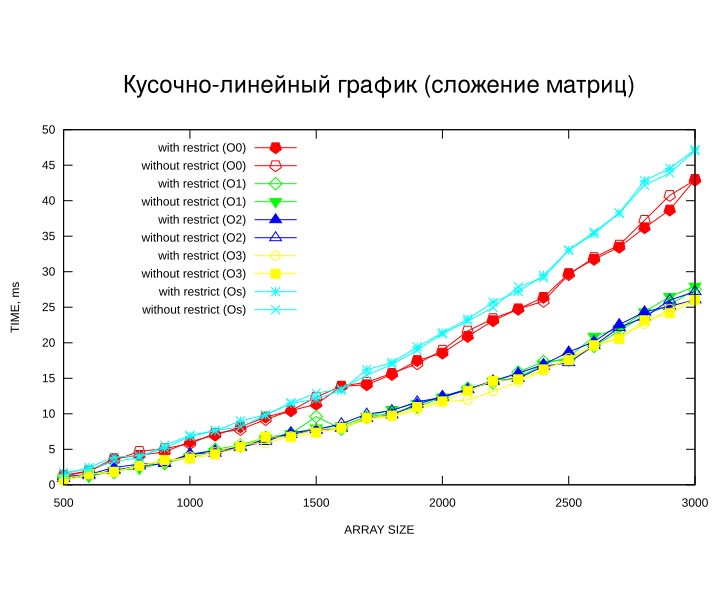
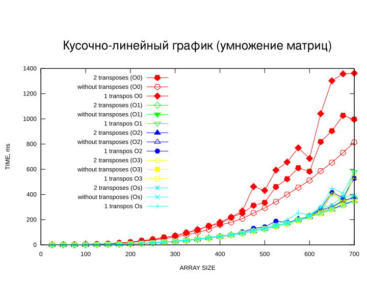
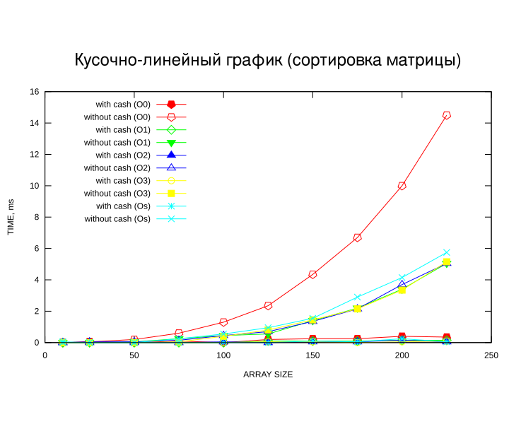

# Measurement experiments

Practice work on measuring C programs rather than writing them. Several implementations
compute the same result, and the question is which one is faster, by how much, whether the
answer survives a change of data size, and whether the compiler erases the difference once
optimisation is turned on. Every comparison is therefore run at `-O0`, `-O1`, `-O2` and
`-O3`.

Everything around the measurement is scripted, which is the real content of the practice.
`build_apps.sh` compiles the variants, `go.sh` drives the series, `update_data.sh`
regenerates the input, the Python scripts prepare the data and reduce the raw timings
afterwards, and gnuplot turns the result into the plots below.

## Arrays

Three ways of walking the same data, by index, by pointer arithmetic and through an array
of pointers.



A single run says little, so the same series is also reduced to minimum, maximum, quartiles
and median.



## Matrices

Addition written with and without `restrict`, which tells the compiler the operands do not
overlap.



Multiplication in three variants, transposing both operands, one of them, or neither.



Sorting in the plain order and in the one that follows how the rows lie in cache.



## Running

```bash
cd src/array_experiment && ./go.sh
```

```bash
cd src/matrix_experiment && ./go.sh
```

The final report with the measurements is in `doc/`.
